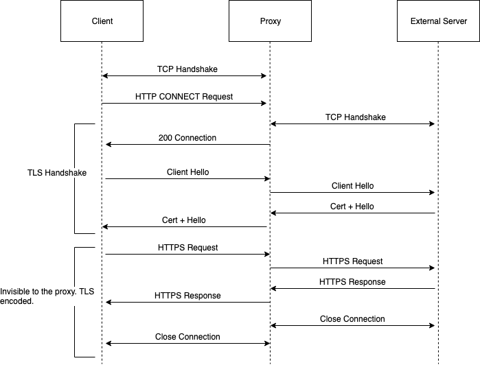

# CS3031 Web Proxy

By: Michael McAndrew

Student No: 16316482

## Overview

This is an implementation of a web proxy compatible with HTTP/HTTPS and WebSockets with a dashboard that logs requests and allows to blacklist URL's. Caching is also implemented for HTTP.

## HTTP

### Protocol


It is becoming increasingly difficult to find websites that use plain HTTP these days since the advent of free SSL certificates. However, if the case arises that a site is using HTTP, the proxy will have to deal with this.

1. The browser initialises a TCP connection with the proxy and sends the HTTP request.
2. The proxy first checks to see if it contains a valid copy of the response in the cache. I will discuss how the cache checks for valid responses in the __Cache__ section of this document. If a valid copy is found in the cache, the server doesn't need to be contacted and the proxy returns the valid copy.
3. If there is no copy in the cache, the proxy then needs to figure out what external server it needs to create a TCP connection with to forward the HTTP request on to. To do this, the proxy can use the __ABSOLUTE URI__ and then forward the request on once the TCP connection has been made.
4. The external server will then send the HTTP response back to the proxy and close the TCP connection.
4. The proxy will then forward the HTTP response back to the browser and close the TCP connection with it. If it is permitted to be entered into the cache, it will also do so. Again, I will discuss how a HTTP Response may be deemed cacheable in the __Cache__ section of this document.

### Implementation

In Go HTTP forwarding is quite straight forward to implement because the built-in HTTP server handles TCP connections for us. A simple handler that I call `handleHTTP` creates a client to send the HTTP Request off to the external server and waits for a response. When it gets a response, it copies it into the response writer for the handler and server sends it back to the browser.

There is also some logic for the caching which I will cover in the __Cache__ section of this document.

```
func (proxy *Proxy) handleHTTP(w http.ResponseWriter, req *http.Request) {
	// Check for url in the blacklist to block.
	for _, url := range proxy.blacklist {
		if strings.Contains(req.URL.Host, url) {
			fmt.Fprintf(w, "Blocked by blacklist!")
			return
		}
	}

	// Check the cache for req.URL to see if there's an entry.
	targetURI := req.RequestURI

	fmt.Println("Request came in for: ", targetURI)

	if proxy.Caching {
		proxy.cache.Mutex.Lock()
		cachedResponse := proxy.cache.Get(targetURI)
		proxy.cache.Mutex.Unlock()
		if cachedResponse != nil {
			isFresh, err := proxy.cache.ItemIsFresh(cachedResponse)
			if err != nil {
				fmt.Fprintf(w, "Error in checking if the response is fresh!")
			}

			if isFresh {
				fmt.Println("Found valid cached version of: ", targetURI, ".")

				fmt.Println(len(cachedResponse.BodyBytes))

				respBody := ioutil.NopCloser(bytes.NewBuffer(cachedResponse.BodyBytes))

				resp := cachedResponse.Packet
				// First copy all of the headers from the response.
				copyHeader(w.Header(), resp.Header)

				// Copy the status code of the response.
				w.WriteHeader(resp.StatusCode)

				// Copy the body of the response.
				io.Copy(w, respBody)
				return
			}
		}
	}

	// Create a http client that forwards the request on to the destination server and waits for a response.
	client := &http.Client{}

	req.RequestURI = "" // Resolves this: Get http: Request.RequestURI can't be set in client requests.
	resp, err := client.Do(req)

	// Checks for any errors in getting a response.
	if err != nil {
		http.Error(w, err.Error(), http.StatusServiceUnavailable)
		return
	}

	// First copy all of the headers from the response.
	copyHeader(w.Header(), resp.Header)

	// Copy the status code of the response.
	w.WriteHeader(resp.StatusCode)

	bodyBytes, err := ioutil.ReadAll(resp.Body)
	if err != nil {
		fmt.Println("Error writing body bytes: ", err)
	}
	resp.Body.Close()

	resp.Body = ioutil.NopCloser(bytes.NewBuffer(bodyBytes))

	// Copy the body of the response.
	io.Copy(w, resp.Body)

	resp.Body.Close()

	// Check that the response is cacheable.
	if proxy.Caching {
		proxy.cache.Mutex.Lock()
		cachedItem := proxy.cache.Get(targetURI)
		proxy.cache.Mutex.Unlock()
		if isCacheable(resp) && cachedItem == nil {
			cacheItem := &cache.CacheItem{
				Key:       targetURI,
				Packet:    resp,
				BodyBytes: bodyBytes,
			}

			proxy.cache.Mutex.Lock()
			proxy.cache.Set(cacheItem)
			proxy.cache.Mutex.Unlock()
			fmt.Println("Inserted item at: ", targetURI, " into the cache!")

			proxy.cache.Mutex.Lock()
			resp = proxy.cache.Get(targetURI).Packet
			proxy.cache.Mutex.Unlock()
		}
	}

	/*
	 * When the handler exits, it will then forward the HTTP response
	 * on to the original sender of the HTTP request.
	 */
```

The contents of the response header is copied into the HTTP handler's writer by using the `copyHeader()` helper function:

```
// Takes all src HTTP request headers and copies them to dst header.
func copyHeader(dst, src http.Header) {
	for name, values := range src {
		dst[name] = values
	}
}
```

## HTTPS and WebSockets

### Protocol



The implementation of HTTPS is slightly more involved than with HTTP. In the case of HTTPS, the browser will first create a TCP connection with the proxy and then attempt a TLS Handshake with the proxy. When the proxy receives a `Client Hello` from the Browser, attempting to implement a TLS Handshake, the proxy must figure out where to forward the `Client Hello` to. However, there is no way for it to know the address because it's not contained in the packet.

To solve this, a `HTTP CONNECT` request is first sent to the proxy to tell it where to forward the TLS Handshake packets. A `HTTP CONNECT` packet simply contains `HOST:PORT`. This HTTP Connect method is also used for WebSockets.

The downside to this approach, which is also one of the benefits of using HTTPS, is that the packets cannot be read by the proxy as they are now encrypted. This prevents caching on the proxy.

### Implementation

The implementation of the `HTTP CONNECT` method for HTTPS and WebSockets requires hijacking the TCP layer to forward all TCP messages from the __Browser__ to the __External Server__. Fortunately, this is quite straight forward to implement in Go. The TCP layer used in Go's HTTP server can be hijacked using the built-in HTTP Hijacker. The handler then tunnels all TCP packets between the Browser and the External Server.

```
func (proxy *Proxy) handleHTTPS(w http.ResponseWriter, r *http.Request) {
	// TCP handshake with server.
	dstServer := r.URL.Host

	// Check for url in the blacklist to block.
	for _, url := range proxy.blacklist {
		if strings.Contains(dstServer, url) {
			return
		}
	}

	dstConnection, err := net.Dial("tcp", dstServer)

	if err != nil {
		http.Error(w, err.Error(), http.StatusServiceUnavailable)
		return
	}

	w.WriteHeader(http.StatusOK)

	// Hijack the TCP connection from the HTTP library so we can tunnel between server and client.
	hijacker, success := w.(http.Hijacker)

	if !success {
		http.Error(w, "Couldn't hijack.", http.StatusInternalServerError)
		return
	}

	srcConnection, _, err := hijacker.Hijack()

	if err != nil {
		http.Error(w, err.Error(), http.StatusServiceUnavailable)
	}

	go tunnel(dstConnection, srcConnection)
	go tunnel(srcConnection, dstConnection)
}

// Tunnels TCP connection between src and dst.
func tunnel(dst, src net.Conn) {
	defer dst.Close()
	defer src.Close()
	io.Copy(dst, src)
}
```

## Request Logging

The configuration of the web server in Go calls a handler every time that a request gets sent to the proxy. The proxy then appends this request to a Go slice with information about the request for logging. The information for each request gets stored in a `Request` struct:

```
type Request struct {
	Timestamp     string `json:"timestamp"`
	Host          string `json:"host"`
	Method        string `json:"method"`
	ContentLength int64  `json:"contentLength"`
	Proto         string `json:"proto"`
}
```

The handler also checks for `HTTP CONNECT` requests to forward the request onto the HTTPS Handler if needed, handles __Management Console__ endpoints which I will cover in the __Management Console__ section of this document.

```
/*
 * Decides whether to forward on the request or handle it internally.
 * Each one of these functions gets called as a goroutine which runs
 * the code in a new thread.
 */
func (proxy *Proxy) httpHandler(w http.ResponseWriter, r *http.Request) {
	t := time.Now()
	formatted := fmt.Sprintf("%d-%02d-%02d %02d:%02d:%02d",
		t.Year(), t.Month(), t.Day(),
		t.Hour(), t.Minute(), t.Second())

	request := Request{
		Timestamp:     formatted,
		Host:          r.Host,
		Method:        r.Method,
		ContentLength: r.ContentLength,
		Proto:         r.Proto,
	}
	proxy.requests = append(proxy.requests, request)

	switch r.URL.Path {
	case "/blacklist":
		proxy.blacklistHandler(w, r)
	case "/requests":
		proxy.getRequestsHandler(w, r)
	default:
		if strings.Contains(r.URL.Path, "/dashboard/") {
			http.ServeFile(w, r, r.URL.Path[1:])
		} else if r.Method == http.MethodConnect {
			proxy.handleHTTPS(w, r)
		} else {
			proxy.handleHTTP(w, r)
		}
	}
}
```

The request log is then be served by the `/requests` endpoint handled by the server in the following http Handler:

```
func (proxy *Proxy) getRequestsHandler(w http.ResponseWriter, r *http.Request) {
	switch r.Method {
	case "GET":
		data := proxy.requests

		out, err := json.Marshal(data)
		if err != nil {
			fmt.Fprintf(w, "Couldn't marshal!")
		}

		w.Header().Set("Content-Type", "application/json")
		w.WriteHeader(http.StatusOK)
		w.Write(out)
	}
}
```

The handler Marshals the slice into JSON that the client can parse.

## Blacklist

The HTTP and HTTPS handlers check for blacklisted Host URL's by including:

```
// Check for url in the blacklist to block.
for _, url := range proxy.blacklist {
  if strings.Contains(req.URL.Host, url) {
    fmt.Fprintf(w, "Blocked by blacklist!")
    return
  }
}
```

The blacklist is a slice of strings that can be read and written to using the `/blacklist` endpoint implemented by the web server:

```
func (proxy *Proxy) blacklistHandler(w http.ResponseWriter, r *http.Request) {
	switch r.Method {
	case "GET":
		data := &BlackList{
			Blacklist: proxy.blacklist,
		}

		out, err := json.Marshal(data)
		if err != nil {
			fmt.Fprintf(w, "Couldn't marshal!")
			return
		}

		w.Header().Set("Content-Type", "application/json")
		w.WriteHeader(http.StatusOK)
		w.Write(out)

	case "POST":
		blacklist := BlackList{}

		// Decode the stuff
		data, err := ioutil.ReadAll(r.Body)
		if err != nil {
			fmt.Fprintf(w, "Couldn't read the body.")
		}

		err = json.Unmarshal(data, &blacklist)
		if err != nil {
			fmt.Fprintf(w, "Decoding error!")
		}

		proxy.blacklist = blacklist.Blacklist

		// Send response
		out, err := json.Marshal(blacklist)
		if err != nil {
			fmt.Fprintf(w, "Couldn't marshal!")
			return
		}

		w.Header().Set("Content-Type", "application/json")
		w.WriteHeader(http.StatusOK)
		w.Write(out)
	}
}
```

This endpoint exists to allow the __Management Console__ to access the blacklist. It works by Marshalling and Unmarshalling between the string slice and JSON, readable by Javascript on the client side.

## Management Console

The Management Console is hosted in a static folder called `/dashboard` that contains a HTML file for the dashboard and Javascript to populate the file with up-to-date requests and blacklist information. The management console also allows to add and delete blacklist items.


The page contains a table for the requests and blacklist and performs a `GET` request on `/requests` and populates the responses appropriately. The blacklist is also populated in a similar manner by calling a `GET` request on `/blacklist`. The blacklist is then updated on an add or remove by a `POST` request to `/blacklist` with the updated list.

```
<!doctype html>

<html lang="en">
<head>
  <meta charset="utf-8">

  <title>Dashboard</title>
  <meta name="description" content="Web Proxy Dashboard">
  <meta name="author" content="Michael McAndrew">

  <link rel="stylesheet" href="css/styles.css">

</head>

<body onload="init()">
  <script src="js/scripts.js"></script>
  <script>
    const init = () => {
      populateRequests()
      populateBlacklist()
    }

    const populateRequests = () => {
      fetch('https://localhost:8888/requests').then((res) => {
        res.json().then((data) => {
          data = data.reverse();
          data.map((request) => {
            let tableElement = document.createElement("tr");

            let fields = ["timestamp", "host", "method", "contentLength", "proto"];

            fields.map((field) => {
              let fieldElement = document.createElement("th");
              fieldElement.appendChild(document.createTextNode(request[field]));
              tableElement.appendChild(fieldElement);
            })

            // Append table element to table.
            let table = document.getElementById("reqs-table")
            table.appendChild(tableElement);
          })
        });
      });
    }

    const addBlacklistItem = (item) => {
      let tableElement = document.createElement("tr");
      tableElement.id = item;
      let nameElement = document.createElement("th");
      let deleteElement = document.createElement("th");

      nameElement.appendChild(document.createTextNode(item));
      tableElement.appendChild(nameElement);

      let deleteButton = document.createElement("button");
      deleteButton.setAttribute("onclick", "removeFromBlacklist(this)");
      deleteButton.value = item;
      deleteElement.appendChild(deleteButton);
      tableElement.appendChild(deleteElement);

      // Append table element to table.
      let table = document.getElementById("blacklist-table");
        table.appendChild(tableElement);
    }

    const removeBlacklistItem = (item) => {
      const table = document.getElementById("blacklist-table");
      const element = document.getElementById(item);
      table.removeChild(element);
    }

    const populateBlacklist = async () => {
      data = await getBlacklist();
      data.map((url) => {
        addBlacklistItem(url)
      });
    }

    const getBlacklist = async () => {
      const result = await fetch('https://localhost:8888/blacklist');
      const data = await result.json();
      return data.blacklist;
    }

    const postBlacklist = (blacklist) => {
      fetch('https://localhost:8888/blacklist', {
        method: 'POST',
        body: JSON.stringify({blacklist: blacklist}),
        headers: {
          'Content-Type': 'application/json'
        }
      });
    }

    const addToBlacklist = async () => {
      const url = document.getElementById("blacklist-text-bar").value;
      document.getElementById("blacklist-text-bar").value = "";
      const blacklist = await getBlacklist();
      blacklist.push(url);

      postBlacklist(blacklist);
      addBlacklistItem(url);
    }

    const removeFromBlacklist = async (item) => {
      let blacklist = await getBlacklist();
      blacklist = blacklist.filter(url => url !== item.value);

      postBlacklist(blacklist);
      removeBlacklistItem(item.value);
    }
  </script>
  <div class="sidebar">
    <div>
      
      <span class="logo-text">Web Proxy</span>
    </div>
    <ul class="sidebar-list">
      <li class="sidebar-list-item">
        <a href="/dashboard/requests.html" class="sidebar-link">
          
          <span class="sidebar-link-text">Home</span>
        </a>
      </li>
      <li class="sidebar-list-item">
        <a href="/dashboard/blacklist.html" class="sidebar-link">
          
          <span class="sidebar-link-text">Blocked Sites</span>
        </a>
      </li>
    </ul>
  </div>
  <div class="requests-container">
    <div class="requests-header">
      <a href="/dashboard/requests.html" class="refresh-button"></a>
      <span class="requests-header-title">Requests</span>
    </div>
    <table class="requests-table" id="reqs-table">
      <tr class="table-title-container">
        <th class="table-title">Timestamp</th>
        <th class="table-title">Host</th>
        <th class="table-title">Method</th>
        <th class="table-title">Content Length</th>
        <th class="table-title">Proto</th>
      </tr>
    </table>
  </div>
  <div class="blacklist-container">
    <div class="requests-header">
      <span class="requests-header-title">Blacklist</span>
    </div>
    <div class="search-bar-container">
      <input class="search-bar" id="blacklist-text-bar" type="text" placeholder="Add url..." on>
      <button id="myBtn" onclick="addToBlacklist()">Add!</button>
    </div>
    <table class="requests-table" id="blacklist-table">
        <tr class="table-title-container">
          <th class="table-title">Blocked</th>
          <th></th>
        </tr>
      </table>
  </div>
</body>
</html>
```

## Caching

I implemented my own LRU Cache by using a map to store responses for corresponding URL's and a Go List, an implementation of a Doubly Linked List to keep track of position of each cache element. When a cache __HIT__ occurs, the element gets promoted it by moving it to the end of the list. If the cache is full, the element at the beginning of the list gets kicked out of the cache to make space for the new cache element. The cache implementation listing is below:

```
package cache

import (
	"container/list"
	"net/http"
	"strconv"
	"strings"
	"sync"
	"time"
)

type Cache struct {
	size  int
	items map[string]*CacheItem
	list  *list.List
	Mutex sync.RWMutex
}

type CacheItem struct {
	Key         string
	listElement *list.Element
	Packet      *http.Response
	BodyBytes   []byte
}

func New(size int) *Cache {
	return &Cache{
		size:  size,
		items: make(map[string]*CacheItem, size),
		list:  list.New(),
		Mutex: sync.RWMutex{},
	}
}

func (cache *Cache) Get(key string) *CacheItem {
	item, exists := cache.items[key]

	if !exists {
		return nil
	}
	cache.moveToFront(item)

	return item
}

func (cache *Cache) moveToFront(item *CacheItem) {
	cache.list.MoveToFront(item.listElement)
}

func (cache *Cache) Set(item *CacheItem) {
	// Check that there's enough room in the cache.
	if cache.list.Len() >= cache.size {
		// Clear up some space.
		cache.prune()
	}

	// Check if the item already exists.
	cacheItem, exists := cache.items[item.Key]
	if exists {
		cache.moveToFront(cacheItem)
	} else {
		// Add to cache.
		item.listElement = cache.list.PushFront(item)
		cache.items[item.Key] = item
	}
}

func (cache *Cache) prune() {
	tail := cache.list.Back()
	if tail == nil {
		return
	}

	item := cache.list.Remove(tail).(*CacheItem)
	delete(cache.items, item.Key)
}

func (cache *Cache) ItemIsFresh(item *CacheItem) (bool, error) {
	header := item.Packet.Header
	if header.Get("Cache-Control") != "" && header.Get("Date") != "" {
		cacheControl := header.Get("Cache-Control")
		cacheControl = strings.TrimSpace(cacheControl)
		controlElements := strings.Split(cacheControl, ",")

		for _, val := range controlElements {
			if strings.Contains(val, "max-age") {
				date, err := http.ParseTime(header.Get("Date"))
				if err != nil {
					return false, err
				}
				maxAge, err := strconv.Atoi(strings.Split(val, "=")[1])
				if err != nil {
					return false, err
				}

				if time.Now().Unix() < date.Unix()+int64(maxAge) {
					return true, nil
				}

				return false, nil
			}
		}
	} else if header.Get("Expires") != "" {
		date, err := http.ParseTime(header.Get("Expires"))
		if err != nil {
			return false, err
		}
		currentDate := time.Now()

		if currentDate.Before(date) {
			return true, nil
		}
	}

	// Checking with the server to see if stale packets are still ok.
	if header.Get("ETag") != "" {
		etag := header.Get("Etag")
		client := &http.Client{}

		req, err := http.NewRequest("HEAD", item.Key, nil)
		if err != nil {
			return false, err
		}

		req.Header.Set("If-None-Match", etag)

		resp, err := client.Do(req)

		if resp.StatusCode == http.StatusNotModified {
			return true, nil
		}
	} else if header.Get("Last-Modified") != "" {
		lastModified := header.Get("Last-Modified")
		client := &http.Client{}

		req, err := http.NewRequest("HEAD", item.Key, nil)
		if err != nil {
			return false, err
		}

		req.Header.Set("If-Modified-Since", lastModified)

		resp, err := client.Do(req)

		if resp.StatusCode == http.StatusNotModified {
			return true, nil
		}
	}

	return false, nil
}
```

The cache must also check that a response is fresh which is achieved by the `ItemIsFresh()` function. The function respects ETags, Cache-Control and Expires headers to a certain degree by the following protocol:

1. Check for max-age in Cache-Control. If one exists, check that the Response isn't past the max-age.
2. If there is no Cache-Control check that there is an Expires header and compare it to the current time.
3. Check that there is an `Etag`. If there is, send a `If-None-Match` `HEAD` request to the server to check that the response is valid.
4. Check that there is a `Last-Modified` header. If there is send a `If-Modified-Since` `HEAD` request to the server to check whether it is up-to-date.

Caching is implemented in HTTP only. To test caching, websites that didn't block caching and that worked on HTTP only were required. The sites that I chose to test on were: `http://infocenter.arm.com` and `http://eu.httpbin.org`. I began by ensuring that the proxy cache was empty. Using the __Network Developer Tools__ in Chromium allowed me to get a load time for each URL. This was used as the base case. I then reloaded each page, ensuring that browser caching wasn't enabled and found the following averaged results after three attempts:

| Site               | Avg. Uncached | Avg. Cached |
|--------------------|---------------|-------------|
| infocenter.arm.com | 1.067s        | 0.840s      |
| eu.httpbin.org     | 1.34s         | 0.397s      |

Notice that the improvements made by caching on `eu.httpbin.org` are much more substantial than that of `infocenter.arm.com`. This is partially because the ARM website has less cacheable content and it also has more requests to make before it gets loaded.

## Concurrency

The HTTP Server in Go has built-in concurrency. Each request handler is spawned off on a new thread in a new go routine. However, the Cache is not concurrent by default. To tackle concurrent calls to the cache, a global mutex is used to ensure that only a single thread can access the cache at any point in time.